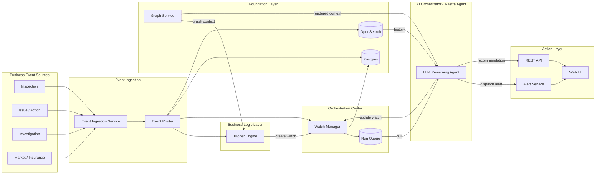

# Component Breakdown

> Tech stack: TypeScript across all services, [Mastra](https://mastra.ai) as the agent framework.

---

## Architecture Diagram



---

## Infrastructure

| Component | Tech | MVP |
|---|---|---|
| Message Broker | Kafka (Redis Streams for local dev) | Yes |
| Container Orchestration | Docker Compose (dev), Kubernetes (prod) | Compose only |
| API Gateway | Nginx (MVP), Kong (prod) | Nginx |

---

## Backend Services

### Event Ingestion Layer
| Component | Responsibility | Tech | MVP |
|---|---|---|---|
| Event Ingestion Service | Receives webhooks from upstream systems, validates, normalizes, deduplicates, publishes to event bus | TypeScript / Hono, Zod schemas, Redis (dedup) | Yes |
| Event Router | Consumes normalized events, fans out to typed Kafka topics for downstream consumers | TypeScript Kafka consumer | Yes |

### Foundation Layer
| Component | Responsibility | Tech | MVP |
|---|---|---|---|
| Graph Service | Foundational shared service — maintains the global business graph and personal graphs per tenant. Provides graph operations (locate node, get upstream/downstream, check SLA violations, render LLM context block) to all business logic services. **Not in the event processing pipeline — queried by other services as needed.** | TypeScript / Hono, graph-lib, YAML config | Yes |

### Business Logic Layer
| Component | Responsibility | Tech | MVP |
|---|---|---|---|
| Trigger Engine | Runs all registered triggers against each incoming event. Each trigger evaluates the event + graph context and returns a `WatchCreationRequest` or null. Any non-null result is handed to the Watch Manager. Ships with `PatternTrigger` and `RuleTrigger` built-in; users add `CustomTrigger` implementations. | TypeScript / Hono, OpenSearch client | Yes |

### Orchestration Center
| Component | Responsibility | Tech | MVP |
|---|---|---|---|
| Watch Manager | The orchestration hub between business logic and AI. Persists watches, runs time-based expiry checks (absence detection), matches incoming events against active watches, and pushes triggered watches onto the run queue for async LLM processing. | TypeScript / Hono, node-cron, Postgres, Redis | Yes |

### AI Layer
| Component | Responsibility | Tech | MVP |
|---|---|---|---|
| LLM Orchestrator | Assembles full context (calls Graph Service for rendered context block + Pattern Engine + Watch Manager) → calls LLM via Mastra → parses structured output → dispatches watch/alert | **Mastra agent** | Yes |
| Alert / Notification Service | Receives structured alerts, routes to Slack and in-app notifications | TypeScript / Hono, Slack SDK | Yes (Slack + in-app) |
| Workflow Trigger Service | Creates tasks in external systems (Jira, Linear) from LLM recommendations | TypeScript / Hono, outbound webhooks | Deferred |

---

## Data Stores

| Store | Responsibility | Tech | MVP |
|---|---|---|---|
| Operational DB | Mutable state: events, watches, alerts, recommendations | Postgres 15, Drizzle ORM | Yes |
| Event History | Historical event search, time-range aggregations, pattern queries | OpenSearch 2.x (or Postgres stub) | Yes / stub first |
| Graph Store | Entity relationship graph (site ↔ issue ↔ incident) for multi-hop queries | Neo4j | Deferred (Postgres FK + CTEs at MVP) |
| Cache | Idempotency keys, session tokens, LLM response cache, pub/sub | Redis 7 | Yes |

---

## AI / LLM Layer (Mastra)

| Component | Responsibility | Tech | MVP |
|---|---|---|---|
| Reasoning Agent | The core Mastra agent: traverses business flow, assesses risk, decides watch vs. direct recommendation, explains why | Mastra agent + Claude (claude-sonnet-4-6) | Yes |
| Prompt Builder / Context Assembler | Assembles structured context (event, node mapping, pattern summary, active watches, history) into the agent's input | Mastra tool inputs + prompt templates | Yes |
| RAG Pipeline | Fetches relevant historical events from OpenSearch before each reasoning call | Mastra tool calling OpenSearch client | Yes (structured queries; vector/semantic deferred) |
| Watch Tool | Mastra tool that creates or updates a `WatchObject` in the Watch Manager | Mastra tool → Watch Manager API | Yes |
| Alert Tool | Mastra tool that dispatches a recommendation or alert | Mastra tool → Alert Service API | Yes |
| LLM Eval Harness | Regression tests for prompt/model changes against golden-labeled fixtures | Vitest, JSON fixtures | Deferred |

---

## Frontend / API

| Component | Responsibility | Tech | MVP |
|---|---|---|---|
| External REST API | Aggregates data from Postgres + OpenSearch; exposes endpoints for timeline, watches, alerts, copilot | TypeScript / Hono, Drizzle | Yes |
| Timeline + Watch Dashboard | Entity event timeline annotated with watches and alerts; watch list sortable by risk/expiry | React 18, TypeScript, TanStack Query, Tailwind | Yes |
| Copilot Panel | Conversational interface for ad-hoc questions ("Why is site_9 flagged?") | React chat UI → Mastra agent stream | Deferred |

---

## Cross-Cutting

| Component | Tech | MVP |
|---|---|---|
| Auth | Auth0 (managed JWT, tenant isolation) | Yes |
| Structured Logging | `pino` → Datadog / Grafana Loki | Yes |
| Metrics + Tracing | OpenTelemetry SDK hooks | Hooks only at MVP |
| CI/CD | GitHub Actions, Vitest, ESLint, Prettier | Yes |

---

## Implementation Sequence

| Phase | Scope |
|---|---|
| 1 | Kafka + Postgres + Event Ingestion Service + canonical `Event` schema |
| 2 | Business Flow Graph Service + Pattern Engine (2 checks) + Watch Manager (storage only) |
| 3 | Mastra Reasoning Agent + Prompt Builder + full sync reasoning path (event in → LLM → watch created) |
| 4 | Watch lifecycle scheduler + Alert Service (Slack) + proactive alert path |
| 5 | REST API + Timeline UI + Watch Dashboard |
| 6 | OTel tracing + LLM eval harness + OpenSearch (if on Postgres stub) + Kong |

---

## Event Processing Paths

Events are processed **synchronously** by the business logic layer, and the LLM is invoked **asynchronously** via the run queue. The two phases are fully decoupled.

### Phase 1 — Synchronous Event Processing (no LLM)

```
Incoming Event
      │
      ▼ (fan-out in parallel)
  ┌───────────────────┬──────────────────┐
  ▼                   ▼                  ▼
Watch Manager    Trigger Engine      Persist
(match check)    (evaluate all       (Postgres
                  triggers)           + OpenSearch)
  │                   │
  ▼                   ▼
match found?     trigger fires?
  │                   │
  └───────────────────┘
           ↓ any triggered?
    Create / update watch in Watch Manager
           ↓
    Push to run queue
```

- **Watch match** — Watch Manager finds an active watch for this entity. Updates watch state, pushes to run queue.
- **Trigger fires** — a registered trigger (PatternTrigger, RuleTrigger, or CustomTrigger) returns a `WatchCreationRequest`. Trigger Engine calls Watch Manager to create the watch, which pushes to run queue.
- **Nothing triggers** — event is stored and acknowledged. **Run queue is not touched.**

### Phase 2 — Async LLM Reasoning (run queue consumer)

```
Run Queue (Kafka: bpollo.watches.triggered)
      │
      ▼
LLM Orchestrator pulls { watch_id, trigger_type, triggering_event }
      │
      ▼ (parallel calls)
  ┌───┴──────────────────┬──────────────────┐
  ▼                      ▼                  ▼
Graph Service        Watch Manager      OpenSearch
(rendered context)   (active watches)   (history)
  └──────────────────────┴──────────────────┘
           ↓
    LLM reasons over full context
           ↓
    Decision: resolve | escalate | spawn | extend | alert_only | expire
           ↓
    Update watch (Watch Manager) + dispatch alert (Alert Service) if needed
```

The LLM is **never on the synchronous event path**. Event processing latency is fully decoupled from LLM latency. The run queue acts as the buffer.

### Stacking
An event can trigger multiple watches simultaneously. Each triggered watch becomes an independent run queue item. The LLM processes them separately, each with its own context.

---

## Event Schema Design

Business events are diverse — an inspection event looks nothing like an insurance claim. Bpollo uses a **base event + domain extension** pattern via Zod discriminated unions, living in `packages/schemas`.

### Base Event

Fields every service needs, regardless of event type:

| Field | Type | Purpose |
|---|---|---|
| `event_id` | `uuid` | Dedup and tracing |
| `event_type` | `string` | Discriminator for routing and graph mapping |
| `entity_id` | `string` | Primary business entity this event relates to |
| `tenant_id` | `string` | Multi-tenancy isolation |
| `source_system` | `string` | Which upstream system emitted this |
| `timestamp` | `datetime` | ISO 8601 UTC |
| `correlation_id` | `uuid?` | Links a chain of related events |

`site_id` and all other domain-specific fields are **not** on the base — they live only on domain events that need them.

### Domain Events

Each event type extends the base with a `z.literal()` on `event_type` and its own typed fields:

```
BaseEventSchema
  ├── inspection.issue_flagged  { site_id, issue_type, severity }
  ├── action.created            { action_id, assigned_to?, due_date? }
  ├── action.overdue            { action_id, overdue_by_hours }
  ├── investigation.opened      { investigation_id, linked_issue_ids }
  └── ...
```

All domain schemas are combined into a single `BpolloEventSchema` discriminated union. **Unknown event types are rejected at the ingestion boundary** — no catch-all fallback.

### How services use it

| Service | What it reads |
|---|---|
| Event Router | `BaseEvent` (`event_type` only) |
| Graph Service | `BaseEvent` (`event_type` + `entity_id`) |
| Pattern Engine | Full narrowed domain type |
| LLM Orchestrator | Full `BpolloEvent` |
| Event Ingestion | Calls `BpolloEventSchema.parse()` — the only validation boundary |

### What is NOT in the event

- Business graph position (`business_node`, `upstream`, `downstream_expected`) — computed by the Graph Service
- Pattern signals — computed by the Pattern Engine
- Watch state — managed by the Watch Manager

---

## Three-Layer Graph Model

Bpollo uses three distinct graphs that operate at different timescales and compose together at reasoning time — analogous to how `CLAUDE.md` files work at different levels.

```
Global Business Graph   (always loaded — universal rules and flow)
        +
Personal Graph          (loaded per tenant — overrides and extensions)
        +
Watch Graph             (loaded per case — real-time dynamic context)
        =
Full context passed to LLM agent
```

### Global Business Graph
The system-wide layer. Defines the universal business flow DAG, node semantics, edge SLAs, and violation descriptions. Applies to all tenants. Set by the system operator, LLM-assisted from user descriptions or documents, reviewed and committed as YAML.

- **Format:** YAML in repo (`services/graph-service/graph-definition.yaml`)
- **Changes:** Via PR — slow, deliberate
- **Scope:** One global graph shared by all tenants

### Personal Graph (Tenant-level)
Layered on top of the global graph — like a project-level `CLAUDE.md`. Tenants don't redefine the whole flow; they override specific SLAs, add domain-specific context, and express what they care about. The `context` field is free-form natural language injected directly into the LLM prompt.

```yaml
# Example: acme-corp personal graph

overrides:
  edges:
    - from: issue.flagged
      to: action.created
      sla_hours: 12
      violation_description: "Acme requires corrective action within 12h per contract SLA."

interests:
  - entity_types: [site, inspection]
    severity: [high, critical]
    regions: [north-america]

context: |
  Acme Corp operates 200+ sites in North America. Safety issues are top priority.
  Any critical finding must be escalated to the regional manager within the day.
```

- **Format:** Stored in Postgres per tenant, editable via UI or conversational setup with LLM
- **Changes:** Tenant-managed, takes effect immediately
- **Scope:** One personal graph per tenant

### Watch Graph (Dynamic, per-case)
Ephemeral graph created by the LLM Orchestrator when a case warrants real-time monitoring. Has a lifecycle (`active → resolved | escalated | expired`). Not defined by humans — generated and managed entirely by the agent.

- **Format:** Structured schema in Postgres with TTL
- **Changes:** Created and updated by the LLM agent in real time
- **Scope:** One watch graph per monitored case

### Composition at Reasoning Time

When the LLM agent reasons over an event, the Prompt Builder assembles all three layers:

1. **Global graph context** — rendered natural language description of the business flow and where the current event sits
2. **Personal graph context** — tenant overrides merged in, free-form `context` block appended
3. **Watch graph context** — active watches for this entity, with expected signals and deadlines

The LLM never sees raw YAML or JSON — only the rendered, composed context block.

---

## Graph Service Design

The Graph Service is the source of truth for the business flow DAG. It serves two masters simultaneously: the system (programmatic traversal) and the LLM (natural language understanding of the flow).

### Graph Definition Format

The graph is defined as a YAML file — version-controlled in the repo, loaded into memory at startup. Each node and edge carries both machine-readable structure and LLM-readable descriptions.

```yaml
# services/graph-service/graph-definition.yaml

nodes:
  inspection.submitted:
    label: "Inspection Submitted"
    description: "A field inspector has completed and submitted a site inspection report."

  issue.flagged:
    label: "Issue Flagged"
    description: "One or more problems were identified in the inspection that require follow-up action."

  action.created:
    label: "Corrective Action Created"
    description: "A task has been created to resolve a flagged issue."

  investigation.opened:
    label: "Investigation Opened"
    description: "A formal investigation has been initiated, typically due to severity or repeated issues."

edges:
  - from: issue.flagged
    to: action.created
    label: "Action Required"
    description: "A flagged issue should result in a corrective action being created."
    expected: true
    sla_hours: 24
    violation_description: "Flagged issue has no corrective action after 24h — historically linked to escalation risk."

  - from: action.created
    to: investigation.opened
    label: "Escalated"
    description: "If the action is insufficient or the issue persists, an investigation is opened."
    expected: false
```

Key fields:

| Field | Purpose |
|---|---|
| `description` | Injected into LLM prompt to explain business meaning of this node/edge |
| `violation_description` | Injected when a violation is detected — gives the LLM pre-written business context |
| `expected` | Tells the Pattern Engine whether absence of this transition is a risk signal |
| `sla_hours` | Gives the Watch Generator a concrete deadline to monitor |

### What the Graph Service does

1. **Loads** the YAML at startup and builds an in-memory graph
2. **Maps** each incoming event to its node position (`current_node`, `upstream`, `downstream_expected`)
3. **Checks** for SLA violations (expected transitions that haven't arrived within `sla_hours`)
4. **Renders** a natural language context block for the LLM — not the raw YAML, but a readable summary

### How the LLM consumes it

The LLM never reads the raw YAML. The Graph Service renders a context block that the Prompt Builder injects directly into the agent's input:

```
Current position: issue.flagged
↳ "One or more problems were identified in the inspection that require follow-up action."

Expected next: action.created (within 24h)
↳ "A flagged issue should result in a corrective action being created."

Status: MISSING — no action.created seen after 18h
↳ "Flagged issue has no corrective action after 24h — historically linked to escalation risk."
```

This gives the LLM natural language business understanding without parsing any structure itself.

### Storage

**MVP:** Single YAML file at `services/graph-service/graph-definition.yaml`, loaded into memory at startup. Graph changes go through PRs — version controlled alongside code.

**Post-MVP:** If tenants need their own graphs or graphs need runtime updates without redeployment, migrate to Postgres as the store with the YAML as the seed/migration format.

### Graph Service API

| Endpoint | Input | Output |
|---|---|---|
| `POST /graph/locate` | Normalized event | `{ current_node, upstream, downstream_expected, sla_violations }` |
| `POST /graph/render-context` | Graph location + violation status | LLM-ready natural language context block |
| `GET /graph/definition` | — | Full graph for inspection/debugging |

---

## Watch Object & Watch Mechanism

The watch system is the async engine of Bpollo — modeled after OS process scheduling. Watches sleep in a wait queue, incoming events act as interrupts that wake matching watches, and the LLM agent is the CPU that processes the run queue.

| OS Concept | Bpollo Equivalent |
|---|---|
| Sleeping process | Watch in `waiting` state |
| Wait queue | Active watch list |
| Interrupt / signal | Incoming business event |
| Waking a process | Event matches a watch → `triggered` |
| Run queue | Queue of triggered watches ready for LLM |
| CPU / scheduler | LLM agent core |
| Timer interrupt | SLA expiry — watch wakes even with no event |
| Process fork | Watch spawns a child watch |
| Process exit | Watch resolved or expired |

### Watch Object Schema

```
watch_id            — unique ID
entity_id           — business entity being monitored
tenant_id           — multi-tenancy isolation
status              — waiting | triggered | running | resolved | escalated | expired
risk_level          — low | medium | high | critical

# Why this watch exists (LLM continuity)
reason              — LLM-generated explanation of why this watch was created
graph_snapshot      — business flow position + personal graph context at creation time

# What will wake this watch (interrupt vectors)
trigger_conditions:
  - type: event_match   — wake when specific event_type arrives for this entity
  - type: absence       — wake when expected event has NOT arrived by deadline
  - type: pattern       — wake when a pattern fires across multiple events

# What we're waiting for
expected_signals:
  - event_type: action.created
    deadline: 2026-03-29T10:00:00Z
    required: true
  - event_type: issue.resolved
    deadline: 2026-04-03T10:00:00Z
    required: false

# Lifecycle
created_at          — when watch was created
expires_at          — hard TTL, watch dies regardless if not resolved
triggered_at        — when last woken
history             — log of all events matched against this watch
```

### The Mechanism

**Event-driven wake:**
```
Incoming event
  → Watch Manager queries: active watches WHERE entity_id matches AND trigger_conditions match
  → Matched watches: status waiting → triggered
  → Push { watch_id, event } onto run queue
  → LLM agent consumes, reasons over (watch context + current event)
  → Returns structured decision
```

**Timer interrupt (absence detection):**
```
node-cron ticks every N minutes
  → Scan watches WHERE expected_signal.deadline < now AND signal not yet received
  → Wake those watches with a synthetic "absence" event
  → Same run queue → LLM reasons: "expected action.created 2h ago — nothing arrived"
```

**LLM decisions (structured output):**

| Decision | Effect |
|---|---|
| `resolve` | All expected signals arrived — close the watch |
| `escalate` | Situation worsened — create higher-priority watch + alert |
| `spawn` | Create a child watch for the next monitoring phase |
| `extend` | Push the deadline, keep watching |
| `alert_only` | Surface a recommendation without changing watch state |
| `expire` | Nothing happened within TTL — close quietly |

### Watch State Machine

```
                    ┌─────────────────────────────────────────────────┐
                    │                                                 │
              created by                                        extend (LLM)
           Trigger Engine /                                          │
           LLM Orchestrator                                          │
                    │                                                 │
                    ▼                                                 │
              ┌──────────┐   event_match fires      ┌─────────────┐  │
              │          │ ─────────────────────────▶│             │  │
              │ waiting  │                           │  triggered  │──┘
              │          │ ─────────────────────────▶│             │
              └──────────┘   absence deadline passed └──────┬──────┘
                    │                                       │
                    │ expires_at                            │ LLM Orchestrator
                    │ passed                                │ picks up from
                    │ (lazy,                                │ run queue
                    │ on next                               ▼
                    │ event)                         ┌─────────────┐
                    │                                │             │
                    │                                │   running   │
                    │                                │             │
                    │                                └──────┬──────┘
                    │                                       │
                    │              ┌────────────────────────┼──────────────────────┐
                    │              │                        │                      │
                    │           resolve                  escalate               expire
                    │           (all signals             (situation             (nothing
                    │           arrived or               worsened)              happened)
                    │           risk gone)                  │                      │
                    │              │                        │                      │
                    ▼              ▼                        ▼                      ▼
              ┌──────────┐  ┌──────────┐           ┌──────────────┐        ┌──────────┐
              │          │  │          │           │              │        │          │
              │ expired  │  │ resolved │           │  escalated   │        │ expired  │
              │          │  │          │           │              │        │          │
              └──────────┘  └──────────┘           └──────┬───────┘        └──────────┘
                                                          │
                                                   spawns new watch
                                                   at higher risk level
                                                          │
                                                          ▼
                                                    ┌──────────┐
                                                    │ waiting  │ (child watch)
                                                    └──────────┘
```

### State Transition Table

| From | To | Trigger | Who |
|---|---|---|---|
| *(created)* | `waiting` | Watch created by Trigger Engine or LLM Orchestrator | Watch Manager |
| `waiting` | `triggered` | Incoming event matches an `event_match` trigger condition | Watch Manager (Kafka consumer) |
| `waiting` | `triggered` | An `absence` deadline passes with no signal received | Watch Manager (scheduler) |
| `waiting` | `expired` | `expires_at` passed — checked lazily on next event or scheduler tick | Watch Manager |
| `triggered` | `running` | LLM Orchestrator dequeues the watch from the run queue | LLM Orchestrator |
| `running` | `resolved` | LLM decision: all expected signals arrived, or risk has passed | LLM Orchestrator → PATCH /watches/:id |
| `running` | `escalated` | LLM decision: situation worsened — also spawns a higher-risk child watch | LLM Orchestrator → PATCH /watches/:id |
| `running` | `waiting` | LLM decision: `extend` — deadline pushed, keep watching | LLM Orchestrator → PATCH /watches/:id |
| `running` | `expired` | LLM decision: nothing meaningful happened within TTL | LLM Orchestrator → PATCH /watches/:id |
| `escalated` | *(spawns)* | New child watch created at higher risk level, enters `waiting` | LLM Orchestrator → POST /watches |

**Terminal states:** `resolved`, `expired` — no further transitions.
**Non-terminal states:** `waiting`, `triggered`, `running`, `escalated` (escalated always spawns a child).

### Key Design Principle

The watch carries the LLM's reasoning context from when it was created (`reason` + `graph_snapshot` + `history`). When it wakes, the agent gets the original context plus the new event — it continues reasoning from where it left off, not from scratch. This is what makes the proactive behavior feel intelligent rather than rule-based.

### Implementation Notes

- **Storage:** Postgres `watches` table, indexed on `(entity_id, status, tenant_id)`
- **Run queue:** Kafka topic `bpollo.watches.triggered` or Redis queue, ordered by `risk_level`
- **Scheduler:** `node-cron` inside the Watch Manager service, tick interval configurable
- **Concurrency:** Row-level locking in Postgres prevents duplicate processing of the same watch
- **Scale risks (post-MVP):** High event throughput with many active watches needs index tuning; simultaneous triggers need priority scheduling in the run queue

---

## Event-Watch Matching Mechanism

When an event arrives at the Watch Manager, it needs to efficiently answer: **which active watches does this event match?** Naively scanning all watches per event breaks at scale. Bpollo uses a two-stage approach: a fast index lookup followed by precise condition evaluation.

### Two-Stage Matching

```
Event arrives at Watch Manager
        │
        ▼
Stage 1: Index Lookup (Redis — O(1))
  → key: watch:idx:{tenant_id}:{entity_id}:{event_type}
  → returns: candidate watch_ids
        │
        ▼
Stage 2: Condition Evaluation (Postgres — precise)
  → load each candidate watch
  → evaluate full trigger_conditions against event payload
  → filter out false positives
        │
        ▼
Confirmed matches → push to run queue
```

### Watch Index (Redis)

When a watch is created, it is indexed in Redis by the events that can wake it:

```
watch:idx:{tenant_id}:{entity_id}:{event_type}  →  Set<watch_id>
watch:idx:{tenant_id}:{entity_id}:*             →  Set<watch_id>  (any event for this entity)
```

On event arrival, the Watch Manager unions both keys to get candidates — constant time regardless of total watch count.

On watch deletion/expiry, the watch_id is removed from all index keys it was registered under.

### TriggerCondition Schema

Each watch declares a list of conditions. A watch wakes when **any** condition matches:

```typescript
type TriggerCondition =
  | {
      type: "event_match"
      event_type: string                      // must match exactly
      filters?: Record<string, unknown>       // optional payload field checks
      // e.g. { severity: "critical" } — only match if event.severity === "critical"
    }
  | {
      type: "absence"
      event_type: string                      // the event we expected but didn't arrive
      deadline: string                        // ISO 8601 — handled by scheduler, not event matching
    }
  | {
      type: "pattern"
      pattern_name: string                    // named pattern check (e.g. "recurrence_3x_7d")
      params?: Record<string, unknown>
    }
```

`event_match` conditions are evaluated at event time. `absence` conditions are evaluated by the scheduler (timer interrupt). `pattern` conditions may trigger an async OpenSearch query.

### Condition Evaluation (Stage 2)

For each candidate watch loaded from Postgres:

```
for each trigger_condition of type "event_match":
  1. event.event_type === condition.event_type?      → no: skip
  2. all condition.filters match event payload?       → no: skip
  3. watch.entity_id matches event.entity_id (or scope allows it)?  → no: skip
  → match confirmed
```

### Match Scope

Watches declare a `scope` that controls which entity's events can wake them:

| Scope | Matches events from |
|---|---|
| `entity` | This exact `entity_id` only (default) |
| `site` | Any entity belonging to the same `site_id` |
| `tenant` | All events for the tenant |

This allows a watch on an inspection to catch action events from any of its linked issues — without requiring the watch to enumerate every child entity.

### Match Result

A confirmed match produces a `WatchMatch` pushed onto the run queue:

```typescript
type WatchMatch = {
  watch_id: string
  trigger_type: "event_match" | "absence" | "pattern"
  triggering_event?: BpolloEvent    // undefined for absence matches
  matched_condition: TriggerCondition
  watch_context: WatchObject        // full watch state at time of match
}
```

The LLM Orchestrator receives this — it has everything needed to reason without making extra calls to the Watch Manager.

### Absence Detection (Timer Path)

The scheduler (node-cron) ticks every minute and scans Postgres for:

```sql
SELECT * FROM watches
WHERE status = 'waiting'
  AND EXISTS (
    SELECT 1 FROM expected_signals
    WHERE deadline < NOW()
    AND received = false
    AND required = true
  )
```

Each result is woken with a synthetic absence event and pushed to the run queue — same path as event-driven matches.

### Stacking

An incoming event can match multiple watches simultaneously. Each match becomes an independent `WatchMatch` on the run queue. The LLM processes them independently — each with its own watch context.

If a single watch has multiple `event_match` conditions and the event satisfies more than one, only the first matched condition is used to construct the `WatchMatch`. The LLM sees the full `trigger_conditions` list and can reason about the others.

---

## LLM Context Structure

When the LLM Orchestrator pulls a `WatchMatch` from the run queue, the Prompt Builder assembles full context from three sources **in parallel** before calling the Mastra agent.

### Context Assembly (parallel calls)

| Source | Call | Content |
|---|---|---|
| Graph Service | `POST /graph/render-context` | Natural language rendering of business flow position, expected transitions, SLA status, tenant personal graph merged in |
| OpenSearch | history query | Top-K similar past cases: recurrence count, escalation rate, prior outcomes |
| Watch Manager | `GET /watches?entity_id=` | Other active watches for this entity (summaries only) |

The `WatchMatch` itself (watch state + triggering event) comes from the run queue — no extra call needed.

### Prompt Structure

```
[SYSTEM]
You are Bpollo, an AI business copilot. Your role is to reason over
business events and active watches, and decide what action to take.
Always explain your reasoning before calling a tool.
Be conservative: only escalate when evidence clearly supports it.

[BUSINESS CONTEXT]
=== Business Flow ===
{Graph Service rendered context block — global graph + tenant personal graph merged}

[TRIGGERED WATCH]
Watch ID:  {watch_id}
Created:   {created_at}
Risk:      {risk_level}
Reason:    "{reason}"
History:   {N prior matches, summarized}

=== What triggered this watch ===
{if event_match}
  Received: {event_type} at {timestamp}
  Details:  {event payload key fields}

{if absence}
  Expected: {event_type} by {deadline}
  Status:   NOT RECEIVED — overdue by {N} hours

[EVIDENCE]
=== Historical context ===
{Top-5 OpenSearch results: similar past cases, recurrence count, escalation rate}

=== Other active watches for this entity ===
{Summarized list — watch reason + risk level only}

[TASK]
Based on the above, reason over the situation and call the appropriate tool.
```

### Agent Tools (output via tool-use)

The agent **calls tools** to take action rather than returning a JSON blob. This allows multiple actions from a single reasoning call and keeps the reasoning natural.

| Tool | Effect |
|---|---|
| `updateWatch(watch_id, { status, expires_at? })` | Resolve, escalate, extend, or expire the triggered watch |
| `createWatch(WatchCreationRequest)` | Spawn a child watch for the next monitoring phase |
| `dispatchAlert({ priority, message, recommendation })` | Send an alert to the user |
| `standDown()` | No action needed — close this reasoning cycle |

### Token Budget

Context is capped to keep cost and latency predictable:

| Section | Budget |
|---|---|
| Graph context block | ~500 tokens |
| Watch context + trigger | ~300 tokens |
| Historical evidence (top-5) | ~500 tokens |
| Other active watches (summaries) | ~150 tokens |
| **Total context** | **~1500 tokens** |

Prompt templates live in `services/llm-orchestrator/prompts/` as Markdown files — versioned independently from code so prompt changes don't require a redeploy.

### Audit Trail

Every reasoning cycle is stored to Postgres before the agent acts:

```
{
  watch_id,
  trigger_type,
  context_snapshot,     // what the agent saw
  agent_reasoning,      // the explanation the agent gave before calling tools
  tools_called,         // which tools were invoked and with what args
  timestamp
}
```

`agent_reasoning` is the answer to "why did the agent do this?" — captured from the agent's natural language explanation before each tool call. This closes the audit trail gap without any additional instrumentation.

---

## Inter-Service Communication

Services communicate via two patterns depending on the moment in the pipeline. All request/response types are defined in `packages/schemas` — shared across services, never duplicated.

| Moment | Pattern | Why |
|---|---|---|
| Event fan-out (ingestion → downstream) | Kafka async | Decoupled, replayable, independent consumers |
| Business logic → Graph Service | HTTP sync | Foundation layer queried on-demand |
| Pattern Engine / Rule Engine → Watch Manager | HTTP sync | Create watch, need confirmation |
| Watch Manager → LLM Orchestrator | Kafka async | Run queue — decouples event latency from LLM latency |
| LLM Orchestrator → Graph Service / OpenSearch | Parallel HTTP sync | Assemble full context before reasoning |
| LLM Orchestrator → Watch Manager / Alert | HTTP sync | LLM needs confirmation of decision |

### Kafka Topics

| Topic | Producer | Consumer | Partition Key |
|---|---|---|---|
| `bpollo.events.raw` | Event Ingestion | Event Router | `entity_id` |
| `bpollo.events.triggers` | Event Router | Trigger Engine | `entity_id` |
| `bpollo.events.watch` | Event Router | Watch Manager | `entity_id` |
| `bpollo.watches.triggered` | Watch Manager | LLM Orchestrator | `entity_id` |

### Graph Service API
Foundation layer — queried by Pattern Engine, Rule Engine, Watch Manager, and LLM Orchestrator.

```
POST /graph/locate
  Body:  { event: BaseEvent }
  Reply: { current_node, upstream, downstream_expected, sla_violations }

POST /graph/render-context
  Body:  { graph_location: GraphLocation, tenant_id: string }
  Reply: { context_block: string }   // LLM-ready natural language

GET  /graph/definition
  Reply: full graph as JSON
```

### Trigger Engine API
```
POST /triggers/evaluate
  Body:  { event: BpolloEvent, graph_location: GraphLocation }
  Reply: { fired: TriggerResult[] }
  // TriggerResult: { trigger_name, watch_creation_request: WatchCreationRequest | null }
```

**Abstract Trigger Interface** (implemented by built-ins and custom triggers):
```typescript
interface Trigger {
  name: string
  evaluate(
    event: BpolloEvent,
    graphLocation: GraphLocation
  ): Promise<WatchCreationRequest | null>
}
```

Built-in implementations:
- `PatternTrigger` — fires based on historical patterns (recurrence, missing action, anomaly)
- `RuleTrigger` — fires based on deterministic conditions (severity + SLA breach)
- `CustomTrigger` — user-defined; implement the interface and register

### Watch Manager API
```
POST   /watches
  Body:  { entity_id, tenant_id, reason, risk_level, trigger_conditions,
           expected_signals, expires_at, graph_snapshot }
  Reply: { watch_id, status }

PATCH  /watches/:id
  Body:  { status?, expected_signals?, expires_at? }
  Reply: { watch_id, status }

GET    /watches
  Query: entity_id, tenant_id, status?
  Reply: { watches: WatchObject[] }
```

### Alert Service API
```
POST /alerts
  Body:  { entity_id, tenant_id, watch_id?, priority, message, recommendation }
  Reply: { alert_id }

GET  /alerts
  Query: tenant_id, user_id?, unread?
  Reply: { alerts: Alert[] }
```

### External REST API (frontend-facing)
```
GET  /entities/:id/timeline
  Reply: { events: BpolloEvent[], watches: WatchObject[], alerts: Alert[] }

GET  /watches
  Query: tenant_id, status?, risk_level?
  Reply: { watches: WatchObject[] }

POST /watches/:id/resolve
  Reply: { watch_id, status }

GET  /alerts
  Query: tenant_id, unread?
  Reply: { alerts: Alert[] }

POST /copilot/query
  Body:  { question: string, entity_id?: string }
  Reply: { answer: string }   // streams from Mastra agent
```

### Shared Schema Types (`packages/schemas`)

| Type | File | Used by |
|---|---|---|
| `BaseEvent`, `BpolloEvent` | `event.ts` | All services |
| `GraphLocation`, `SLAViolation` | `graph.ts` | Graph Service, Pattern Engine, LLM Orchestrator |
| `TriggerResult`, `WatchCreationRequest` | `trigger.ts` | Trigger Engine, Watch Manager, LLM Orchestrator |
| `WatchObject`, `WatchTrigger`, `TriggerCondition`, `ExpectedSignal` | `watch.ts` | Watch Manager, LLM Orchestrator, Alert Service, API |
| `LLMDecision` | `decision.ts` | LLM Orchestrator, Watch Manager |
| `Alert` | `alert.ts` | Alert Service, API, Web UI |

---

## Critical Files

| File | Why it matters |
|---|---|
| `services/graph-service/graph-definition.yaml` | Business flow DAG config — wrong node names cascade across Pattern Engine, Watch Generator, and Prompt Builder |
| `services/llm-orchestrator/agent.ts` | The Mastra agent definition — tool bindings, model config, system prompt |
| `services/llm-orchestrator/prompts/reasoning.md` | Core prompt template — determines LLM output quality; must be versioned independently from code |
| `services/watch-manager/schema.ts` | `WatchObject` Zod/Drizzle schema — central contract shared across LLM Orchestrator, Watch Manager, Alert Service, and frontend |
| `services/event-ingestion/schema.ts` | Canonical `Event` Zod schema — every downstream service depends on this shape |
