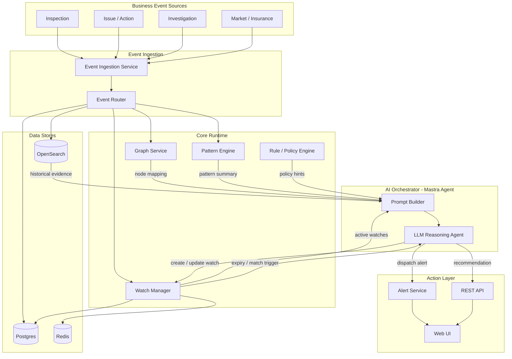

# Component Breakdown

> Tech stack: TypeScript across all services, [Mastra](https://mastra.ai) as the agent framework.

---

## Architecture Diagram

---

## Infrastructure

| Component | Tech | MVP |
|---|---|---|
| Message Broker | Kafka (Redis Streams for local dev) | Yes |
| Container Orchestration | Docker Compose (dev), Kubernetes (prod) | Compose only |
| API Gateway | Nginx (MVP), Kong (prod) | Nginx |

---

## Backend Services

| Component | Responsibility | Tech | MVP |
|---|---|---|---|
| Event Ingestion Service | Receives webhooks from upstream systems, validates, normalizes, deduplicates, publishes to event bus | TypeScript / Hono, Zod schemas, Redis (dedup) | Yes |
| Event Router | Consumes normalized events, fans out to typed topics / downstream consumers | TypeScript Kafka consumer | Yes |
| Business Flow Graph Service | Loads the business flow DAG from config, maps each event to its node position and expected transitions | TypeScript / Hono, graph-lib, YAML graph config | Yes |
| Pattern / Insight Engine | Detects missing actions, recurrence, anomalies by querying event history | TypeScript / Hono, OpenSearch client | Yes (2–3 checks) |
| Watch Graph Generator | Builds `WatchObject` from LLM + policy output; co-located with Watch Manager | TypeScript module | Yes |
| Active Watch Manager | Persists watches, runs time-based expiry checks, matches future events against active watches, triggers re-reasoning on match | TypeScript / Hono, node-cron, Postgres, Redis | Yes |
| Rule / Policy Engine | Deterministic rules evaluated before LLM to short-circuit clear-cut cases and reduce noise | TypeScript module, YAML-defined rules | Yes |
| LLM Orchestrator | Coordinates the reasoning pipeline: assembles context → calls LLM via Mastra → parses structured output → dispatches watch/alert | **Mastra agent** | Yes |
| Alert / Notification Service | Receives structured alerts, routes to Slack and in-app notifications | TypeScript / Hono, Slack SDK | Yes (Slack + in-app) |
| Workflow Trigger Service | Creates tasks in external systems (Jira, Linear) from LLM recommendations | TypeScript / Hono, outbound webhooks | Deferred |

---

## Data Stores

| Store | Responsibility | Tech | MVP |
|---|---|---|---|
| Operational DB | Mutable state: events, watches, alerts, recommendations | Postgres 15, Drizzle ORM | Yes |
| Event History | Historical event search, time-range aggregations, pattern queries | OpenSearch 2.x (or Postgres stub) | Yes / stub first |
| Graph Store | Entity relationship graph (site ↔ issue ↔ incident) for multi-hop queries | Neo4j | Deferred (Postgres FK + CTEs at MVP) |
| Cache | Idempotency keys, session tokens, LLM response cache, pub/sub | Redis 7 | Yes |

---

## AI / LLM Layer (Mastra)

| Component | Responsibility | Tech | MVP |
|---|---|---|---|
| Reasoning Agent | The core Mastra agent: traverses business flow, assesses risk, decides watch vs. direct recommendation, explains why | Mastra agent + Claude (claude-sonnet-4-6) | Yes |
| Prompt Builder / Context Assembler | Assembles structured context (event, node mapping, pattern summary, active watches, history) into the agent's input | Mastra tool inputs + prompt templates | Yes |
| RAG Pipeline | Fetches relevant historical events from OpenSearch before each reasoning call | Mastra tool calling OpenSearch client | Yes (structured queries; vector/semantic deferred) |
| Watch Tool | Mastra tool that creates or updates a `WatchObject` in the Watch Manager | Mastra tool → Watch Manager API | Yes |
| Alert Tool | Mastra tool that dispatches a recommendation or alert | Mastra tool → Alert Service API | Yes |
| LLM Eval Harness | Regression tests for prompt/model changes against golden-labeled fixtures | Vitest, JSON fixtures | Deferred |

---

## Frontend / API

| Component | Responsibility | Tech | MVP |
|---|---|---|---|
| External REST API | Aggregates data from Postgres + OpenSearch; exposes endpoints for timeline, watches, alerts, copilot | TypeScript / Hono, Drizzle | Yes |
| Timeline + Watch Dashboard | Entity event timeline annotated with watches and alerts; watch list sortable by risk/expiry | React 18, TypeScript, TanStack Query, Tailwind | Yes |
| Copilot Panel | Conversational interface for ad-hoc questions ("Why is site_9 flagged?") | React chat UI → Mastra agent stream | Deferred |

---

## Cross-Cutting

| Component | Tech | MVP |
|---|---|---|
| Auth | Auth0 (managed JWT, tenant isolation) | Yes |
| Structured Logging | `pino` → Datadog / Grafana Loki | Yes |
| Metrics + Tracing | OpenTelemetry SDK hooks | Hooks only at MVP |
| CI/CD | GitHub Actions, Vitest, ESLint, Prettier | Yes |

---

## Implementation Sequence

| Phase | Scope |
|---|---|
| 1 | Kafka + Postgres + Event Ingestion Service + canonical `Event` schema |
| 2 | Business Flow Graph Service + Pattern Engine (2 checks) + Watch Manager (storage only) |
| 3 | Mastra Reasoning Agent + Prompt Builder + full sync reasoning path (event in → LLM → watch created) |
| 4 | Watch lifecycle scheduler + Alert Service (Slack) + proactive alert path |
| 5 | REST API + Timeline UI + Watch Dashboard |
| 6 | OTel tracing + LLM eval harness + OpenSearch (if on Postgres stub) + Kong |

---

## Critical Files

| File | Why it matters |
|---|---|
| `services/graph-service/graph-definition.yaml` | Business flow DAG config — wrong node names cascade across Pattern Engine, Watch Generator, and Prompt Builder |
| `services/llm-orchestrator/agent.ts` | The Mastra agent definition — tool bindings, model config, system prompt |
| `services/llm-orchestrator/prompts/reasoning.md` | Core prompt template — determines LLM output quality; must be versioned independently from code |
| `services/watch-manager/schema.ts` | `WatchObject` Zod/Drizzle schema — central contract shared across LLM Orchestrator, Watch Manager, Alert Service, and frontend |
| `services/event-ingestion/schema.ts` | Canonical `Event` Zod schema — every downstream service depends on this shape |
