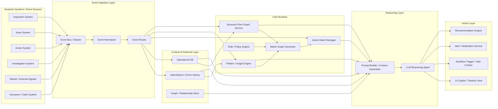
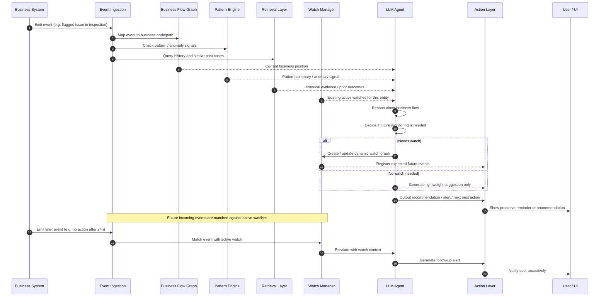
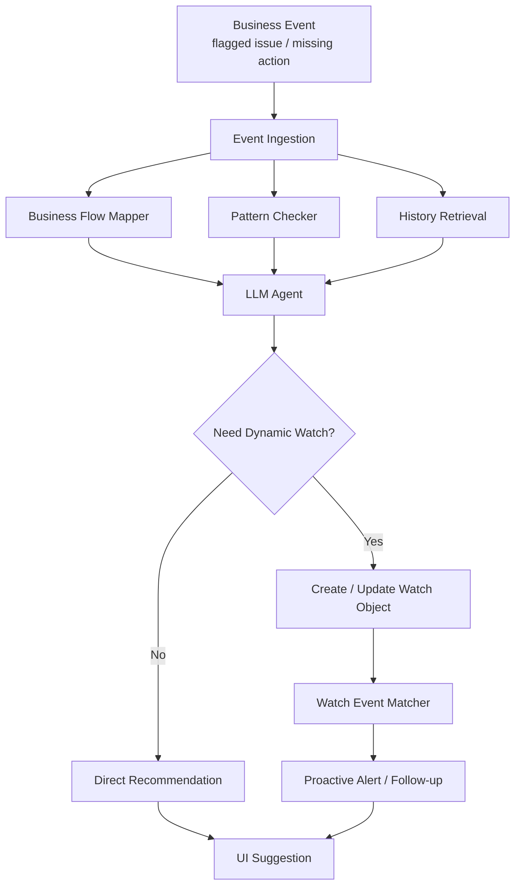

# System Design Document

## Overview

> **An event-driven business copilot that maps real-time events onto a business flow graph, detects abnormal patterns, creates dynamic watch graphs for important cases, and proactively follows up on future signals.**

---

## 1. System Architecture



---

## 2. Layer Breakdown

The system is organized into 6 layers.

### A. Business Systems / Event Sources

Real-world business event origins:

- Inspection submissions
- Issue creation
- Action creation / overdue
- Investigation opened
- Market signals
- Insurance claims

These systems do not require AI — they simply produce a continuous stream of business facts.

### B. Event Ingestion Layer

Receives and normalizes raw business events:

- **Event Bus / Stream** — collects real-time or near-real-time events
- **Event Normalizer** — standardizes event format
- **Event Router** — dispatches events to downstream modules

This is the entry point of the runtime.

### C. Core Runtime

The most critical layer.

#### 1) Business Flow Graph Service

Maintains the primary business flow graph:

```
inspection → issue / action → investigation → market → insurance
```

Responsibilities:
- Locate where a given event sits within the business flow
- Define upstream / downstream relationships
- Identify normal paths vs. abnormal paths

#### 2) Pattern / Insight Engine

Detects patterns such as:

- Repeated issues
- Missing expected actions
- Anomalies
- Escalating risk

#### 3) Watch Graph Generator

The key innovation of this system. When an event warrants ongoing attention, this component dynamically generates a temporary watch graph, e.g.:

- Was an action created within 24h?
- Did the issue recur within 7 days?
- Did it escalate to an investigation?

#### 4) Active Watch Manager

Manages all cases currently under monitoring:

- `active`
- `resolved`
- `escalated`
- `expired`

#### 5) Rule / Policy Engine

Encodes deterministic rules, e.g.:

- A flagged issue should normally have a corresponding action
- An overdue action after X hours triggers escalation
- Severe issue types require stronger monitoring windows

### D. Context & Retrieval Layer

Provides evidence to support reasoning.

#### OpenSearch / Event History

Queries historical events, similar patterns, and time-window aggregations:

- How many times has this type of issue occurred in the past 90 days?
- Has it ever escalated to a major incident?
- Is this site a repeat offender?

#### Operational DB

Stores structured state: watch objects, current case data.

#### Graph / Relationship Store

For later complexity, stores:

- Issue-to-action relationships
- Site-to-incident relationships
- Dependencies between business nodes

This layer can be simplified for MVP.

### E. Reasoning Layer

The LLM is not responsible for managing the whole system. Its role is to:

- Traverse the business flow graph to understand the current event
- Combine historical evidence to assess risk
- Decide whether a watch is needed
- Explain why an alert should be raised
- Recommend next steps

The **Prompt Builder / Context Assembler** is critical — it packages:

- The current event
- Its position in the business flow
- Active watches
- Retrieved historical evidence
- Pattern summaries

...into a context the LLM can reason over.

### F. Action Layer

Final output to users or downstream systems:

- Recommendations
- Alerts
- Workflow triggers
- UI timeline / copilot view

This is the layer where proactive interaction becomes visible to users.

---

## 3. Data Flow

This diagram shows what happens when an event enters the system and how the system decides whether to monitor the future.



---

## 4. Core Data Flow Logic

The key insight of this system is not one-time event analysis — it is this chain:

### Step 1: Event occurs

Example: An inspection contains 3 flagged issues, 1 of which has no action.

### Step 2: Locate position in business flow

Business Flow Graph determines:

- Current position: `inspection → issue` node
- Normal downstream: an `action` should follow

### Step 3: Pattern Engine checks for anomaly

Example findings:

- Historically, similar flagged issues almost always produce an action
- This issue type has been linked to major incidents before

### Step 4: Retrieval pulls historical evidence

Example:

- 12 similar issues in the past 6 months
- 10 had a corresponding action created
- 2 escalated to an investigation
- 1 was linked to a major incident

### Step 5: LLM reasons along the business flow

The LLM does not guess — it reasons based on:

- Current business position
- Historical patterns
- Past outcomes
- Whether a critical action is missing

Output:

- This case warrants monitoring
- Create a temporary watch
- Watch for: action creation, repeated issue, investigation opened

### Step 6: Dynamic Watch Graph is created

```json
{
  "watch_id": "watch_001",
  "status": "active",
  "reason": "flagged issue missing expected action",
  "expected_events": [
    "action_created",
    "issue_repeated",
    "investigation_opened"
  ],
  "risk_level": "high"
}
```

### Step 7: Future events are matched against active watches

This is what enables truly proactive interaction:

- No action after 24h → proactive reminder
- Issue recurs within 7 days → escalated alert
- Investigation opened → high-priority alert

---

## 5. MVP Architecture (Simplified)



---

## 6. Core Data Objects (MVP)

### Event

Raw business event.

```json
{
  "event_id": "evt_001",
  "event_type": "issue_flagged",
  "entity_id": "inspection_123",
  "site_id": "site_9",
  "issue_type": "safety_hazard",
  "timestamp": "2026-03-27T10:00:00Z"
}
```

### Business Node Mapping

Maps an event to its position in the business flow graph.

```json
{
  "event_id": "evt_001",
  "business_node": "inspection.issue",
  "upstream": ["inspection"],
  "downstream_expected": ["action", "investigation"]
}
```

### Pattern Summary

Output from the Pattern / Insight Engine.

```json
{
  "entity_id": "site_9",
  "pattern_type": "missing_expected_action",
  "evidence": {
    "historical_action_rate": 0.9,
    "incident_linked_before": true
  }
}
```

### Watch Object

A dynamically created monitoring target.

```json
{
  "watch_id": "watch_001",
  "status": "active",
  "reason": "flagged issue missing expected action",
  "expected_events": [
    "action_created",
    "issue_repeated",
    "investigation_opened"
  ],
  "risk_level": "high"
}
```

### Recommendation / Alert

Final output surfaced to the user.

```json
{
  "watch_id": "watch_001",
  "message": "This flagged issue is missing an expected action and has historical links to severe incidents. Recommend creating a corrective action within 24 hours.",
  "priority": "high"
}
```

---

## 7. Next Steps

A natural next phase would be a detailed **component diagram + table / schema design** for the engineering implementation.
