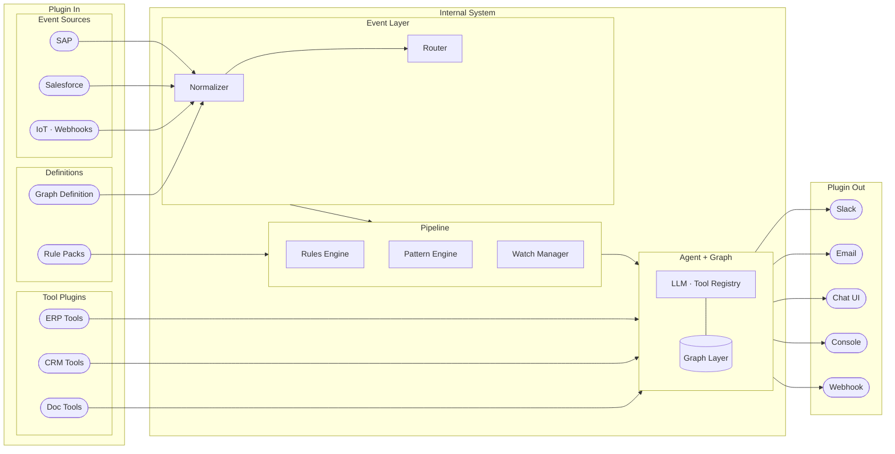
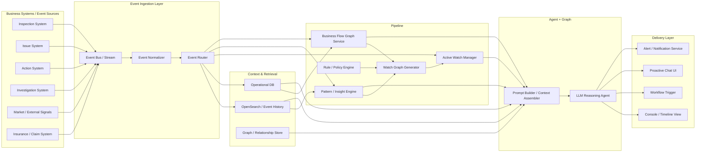
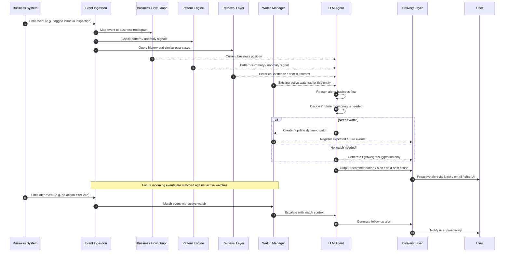

# System Design Document

## Overview

> **An AI-native business copilot that maps real-time events onto a business graph, detects anomalies, creates dynamic watches for important cases, and proactively reasons over future signals.**

---

## 1. Layer Architecture

Bpollo is built as a general framework. The **Agent + Graph** is the true core — the reasoning brain grounded in business topology. Everything else exists to feed it signals, arm it with capabilities, and deliver its decisions.


```mermaid
flowchart LR
    subgraph LEFT["Plugin In"]
        direction TB
        subgraph SRC["Event Sources"]
            S1([SAP])
            S2([Salesforce])
            S3([IoT · Webhooks])
        end
        subgraph DEF["Definitions"]
            D1([Graph Definition])
            D2([Rule Packs])
        end
        subgraph TPLUG["Tool Plugins"]
            T1([ERP Tools])
            T2([CRM Tools])
            T3([Doc Tools])
        end
    end

    subgraph SYS["Internal System"]
        direction LR
        subgraph EL["Event Layer"]
            E1[Normalizer]
            E2[Router]
            E1 --> E2
        end
        subgraph PIPE["Pipeline"]
            P1[Rules Engine]
            P2[Pattern Engine]
            P3[Watch Manager]
        end
        subgraph CORE["Agent + Graph"]
            AG[LLM · Tool Registry]
            GR[(Graph Layer)]
            AG --- GR
        end
        EL --> PIPE
        PIPE --> CORE
    end

    subgraph RIGHT["Plugin Out"]
        direction TB
        R1([Slack])
        R2([Email])
        R3([Chat UI])
        R4([Console])
        R5([Webhook])
    end

    S1 & S2 & S3 --> E1
    D1 --> E1
    D2 --> PIPE
    T1 & T2 & T3 --> CORE

    CORE --> R1 & R2 & R3 & R4 & R5
```

### Three zones inside the system

| Zone | Components | Role |
|---|---|---|
| Event Layer | Normalizer · Router | Receives and standardizes all inbound events from any source |
| Pipeline | Rules Engine · Pattern Engine · Watch Manager | Pre-filters noise; produces signals worth reasoning over |
| Agent + Graph | LLM · Tool Registry · Graph Layer | The reasoning brain; graph provides business constraint; tools provide reach |

### Plugin seams

**Plugin In — two categories:**
- **Event source plugins** — connect third-party systems to the Event Layer. Each plugin adapts external events into the internal `BpolloEvent` format and declares the event types it emits.
- **Tool plugins** — register domain-specific capabilities directly into the Agent's tool registry. The agent calls these mid-reasoning to access real business data (orders, supplier history, documents). Tool plugins bypass the pipeline entirely — they are capabilities, not signals.

**Plugin Out:**
- **Delivery plugins** — receive the agent's output and push to users via Slack, email, proactive chat UI, console, or custom webhooks. The framework fans out to all registered channels for the tenant.

### Why Agent + Graph is the core

The pipeline (rules, patterns, watch engine) is infrastructure — it filters and routes. The Graph is the knowledge structure that tells the agent *where* in a business process an entity sits and *what relationships matter*. Together, Agent + Graph makes this AI-native: the LLM doesn't reason in a vacuum, it reasons within the constraints of a real business model.

---

## 2. System Components

Detailed view of all components and their connections.


```mermaid
flowchart LR
    subgraph A[Business Systems / Event Sources]
        A1[Inspection System]
        A2[Issue System]
        A3[Action System]
        A4[Investigation System]
        A5[Market / External Signals]
        A6[Insurance / Claim System]
    end

    subgraph B[Event Ingestion Layer]
        B1[Event Bus / Stream]
        B2[Event Normalizer]
        B3[Event Router]
    end

    subgraph C[Pipeline]
        C1[Business Flow Graph Service]
        C2[Pattern / Insight Engine]
        C3[Watch Graph Generator]
        C4[Active Watch Manager]
        C5[Rule / Policy Engine]
    end

    subgraph D[Context & Retrieval]
        D1[OpenSearch / Event History]
        D2[Operational DB]
        D3[Graph / Relationship Store]
    end

    subgraph E[Agent + Graph]
        E1[LLM Reasoning Agent]
        E2[Prompt Builder / Context Assembler]
    end

    subgraph F[Delivery Layer]
        F1[Alert / Notification Service]
        F2[Proactive Chat UI]
        F3[Workflow Trigger]
        F4[Console / Timeline View]
    end

    A1 & A2 & A3 & A4 & A5 & A6 --> B1
    B1 --> B2 --> B3

    B3 --> C1
    B3 --> C2
    B3 --> C4
    B3 --> D2
    B3 --> D1

    C1 --> E2
    C2 --> E2
    C3 --> C4
    C4 --> E2
    C5 --> C3
    C2 --> C3
    C1 --> C3

    D1 --> E2
    D1 --> C2
    D2 --> E2
    D2 --> C1
    D3 --> E2

    E2 --> E1
    E1 --> F1 & F2 & F3 & F4
```

---

## 3. Data Flow

What happens when an event enters the system and how the system decides whether to monitor the future.


```mermaid
sequenceDiagram
    autonumber
    participant S as Business System
    participant I as Event Ingestion
    participant B as Business Flow Graph
    participant P as Pattern Engine
    participant R as Retrieval Layer
    participant W as Watch Manager
    participant L as LLM Agent
    participant A as Delivery Layer
    participant U as User

    S->>I: Emit event (e.g. flagged issue in inspection)
    I->>B: Map event to business node/path
    I->>P: Check pattern / anomaly signals
    I->>R: Query history and similar past cases

    B-->>L: Current business position
    P-->>L: Pattern summary / anomaly signal
    R-->>L: Historical evidence / prior outcomes
    W-->>L: Existing active watches for this entity

    L->>L: Reason along business flow
    L->>L: Decide if future monitoring is needed

    alt Needs watch
        L->>W: Create / update dynamic watch
        W-->>A: Register expected future events
    else No watch needed
        L-->>A: Generate lightweight suggestion only
    end

    L->>A: Output recommendation / alert / next best action
    A->>U: Proactive alert via Slack / email / chat UI

    Note over W,I: Future incoming events are matched against active watches

    S->>I: Emit later event (e.g. no action after 24h)
    I->>W: Match event with active watch
    W->>L: Escalate with watch context
    L->>A: Generate follow-up alert
    A->>U: Notify user proactively
```

---

## 4. Core Data Flow Logic

The key insight of this system is not one-time event analysis — it is this chain:

### Step 1: Event occurs

Example: An inspection contains 3 flagged issues, 1 of which has no action.

### Step 2: Locate position in business flow

Business Flow Graph determines:

- Current position: `inspection → issue` node
- Normal downstream: an `action` should follow

### Step 3: Pattern Engine checks for anomaly

Example findings:

- Historically, similar flagged issues almost always produce an action
- This issue type has been linked to major incidents before

### Step 4: Retrieval pulls historical evidence

Example:

- 12 similar issues in the past 6 months
- 10 had a corresponding action created
- 2 escalated to an investigation
- 1 was linked to a major incident

### Step 5: LLM reasons along the business flow

The LLM does not guess — it reasons based on:

- Current business position
- Historical patterns
- Past outcomes
- Whether a critical action is missing

Output:

- This case warrants monitoring
- Create a temporary watch
- Watch for: action creation, repeated issue, investigation opened

### Step 6: Dynamic Watch is created

```json
{
  "watch_id": "watch_001",
  "status": "active",
  "reason": "flagged issue missing expected action",
  "expected_events": [
    "action_created",
    "issue_repeated",
    "investigation_opened"
  ],
  "risk_level": "high"
}
```

### Step 7: Future events are matched against active watches

This is what enables truly proactive interaction:

- No action after 24h → proactive reminder
- Issue recurs within 7 days → escalated alert
- Investigation opened → high-priority alert

---

## 5. Core Data Objects

### Event

Raw business event.

```json
{
  "event_id": "evt_001",
  "event_type": "issue_flagged",
  "entity_id": "inspection_123",
  "site_id": "site_9",
  "issue_type": "safety_hazard",
  "timestamp": "2026-03-27T10:00:00Z"
}
```

### Business Node Mapping

Maps an event to its position in the business flow graph.

```json
{
  "event_id": "evt_001",
  "business_node": "inspection.issue",
  "upstream": ["inspection"],
  "downstream_expected": ["action", "investigation"]
}
```

### Pattern Summary

Output from the Pattern / Insight Engine.

```json
{
  "entity_id": "site_9",
  "pattern_type": "missing_expected_action",
  "evidence": {
    "historical_action_rate": 0.9,
    "incident_linked_before": true
  }
}
```

### Watch Object

A dynamically created monitoring target.

```json
{
  "watch_id": "watch_001",
  "status": "active",
  "reason": "flagged issue missing expected action",
  "expected_events": [
    "action_created",
    "issue_repeated",
    "investigation_opened"
  ],
  "risk_level": "high"
}
```

### Alert

Final output surfaced to the user.

```json
{
  "watch_id": "watch_001",
  "priority": "high",
  "message": "Flagged issue is missing an expected action and has historical links to severe incidents.",
  "recommendation": "Create a corrective action within 24 hours."
}
```

---

## 6. Next Steps

A natural next phase would be a detailed **component diagram + schema design** for the engineering implementation.
